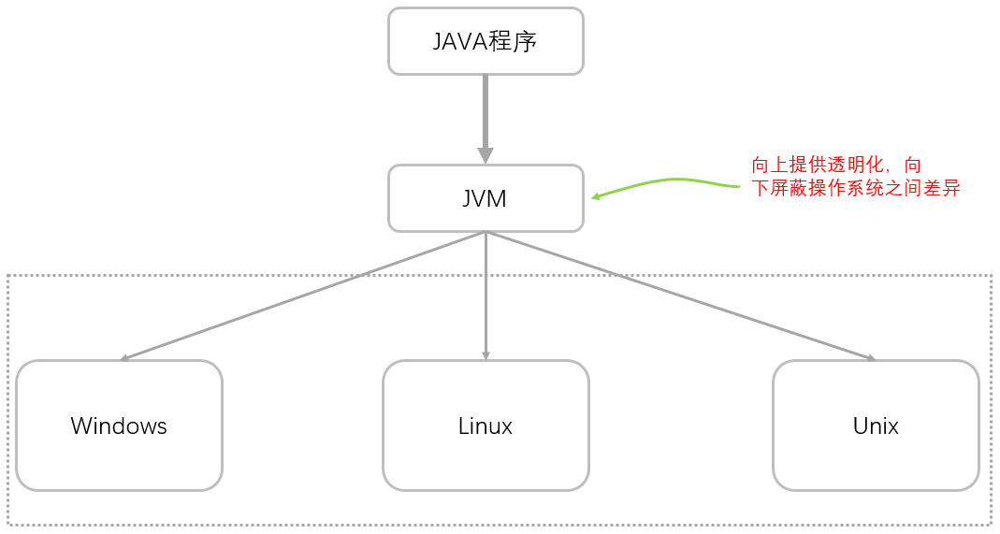
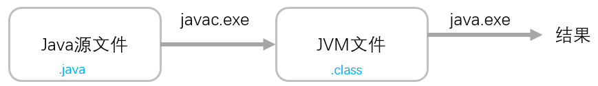
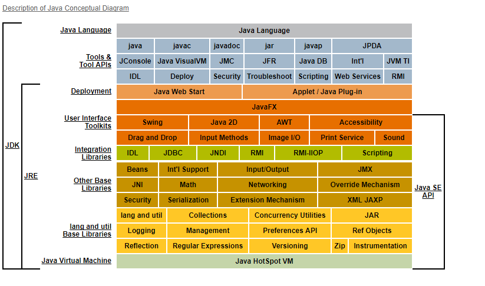
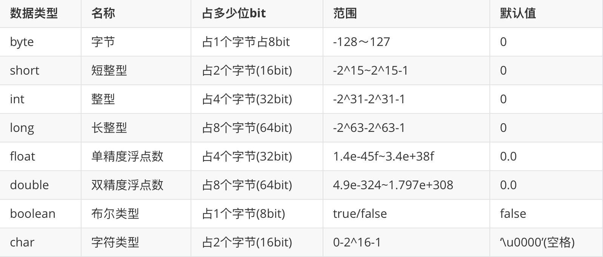

# 总结昨日

***markdown - 半个小时***

* jvm - 跨平台性(java语言),但是jvm是不跨平台的

   

* 执行的流程

   

* jdk和jre和jvm

   

# 变量

java中就是使用**变量和数据类型**来定义和存储数据的.数据存储的介质 - 磁盘和内存.

内存中的数据需要持久化[保存]到磁盘中.编程的核心就是对数据进行CRUD操作[create,retrieve,update,delete]

增删改查.

现阶段:数据都是在内存中的.java只能操作内存中的数据.

## 变量的分类

* ***基本数据类型***

  常规说法是八大种(byte,short,int,long,float,double,char,boolean)

  ***编程思想***书籍中将void归类为基本数据类型[九大基本数据类型].

* 对象类型

  * 内置对象类型(jdk中已经内置的) - 比如System,String,Date...
  * 自定义对象类型[开发者自己写的] - **无数种**

# 基本数据类型图

byte,short,int,long - 表示整数的

float和double都是用来表示小数的.**只是double会比float多消耗两倍的内存空间.**

 

# 变量定义和使用

变量的命名请参考类的命名,唯一的区别,推荐使用小驼峰命名.[helloWorld]

~~~java
语法:
数据类型 变量名 [= 初始值];
定义一个int类型的变量,并且初始值设置成10;

//代码的背后
//
int i = 10;
~~~

## 变量的赋值方式

* 在定义变量的同时进行赋值操作

* 可以先声明一个变量,然后再进行赋值,但是需要注意的是

  变量在使用之前,一定要先进行初始化操作.

* 可以进行统一赋值

  int x=10,y=20,z=30;

* 可以进行链式赋值

  ~~~java
  int x,y,z;//同时声明了三个变量
  x = y = z = 100;
  ~~~

* 可以通过表达式进行赋值

  表达式:由变量或者字面量以及运算符组成的合法的语句.

  ~~~java
  int a = 100;
  int result = a + 1;
  ~~~

* 可以通过方法进行赋值[暂时了解]

  可以将一个方法的调用的结果赋值给一个变量

# 类型的转换

简介:java中看到一个整数,默认的就是int类型,看到一个小数,默认的就是double类型.

并且,不同的数据类型在进行计算的时候,计算得到的结果是偏向大的一方.

## 自动类型转换

简介:小的数据类型可以自动转换成大的数据类型.

byte->short->int->long

int->double

char->int

## 强制类型转换

简介:大的数据类型在转换成小的数据类型时候会有精度的丢失,需要进行强制类型转换.

防止在程序的运行期间出现问题.所以在编译期间就要进行强制类型转换的处理.

大的数据类型 变量max = 初始值;

小的数据类型 变量min = (小的是类型)变量max;

## 隐式转换

