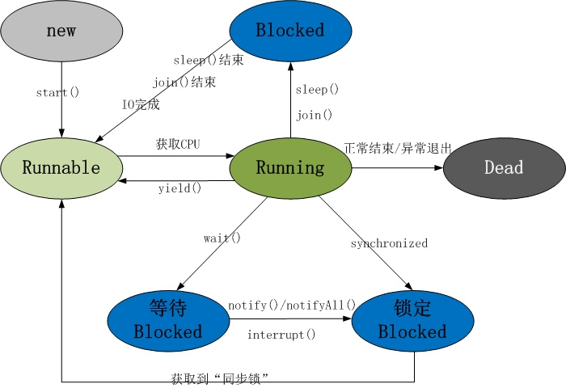

# 进程和线程

* 进程：是并发执行的**程序在执行过程中分配和管理资源的基本单位**，是一个动态概念，***竞争计算机系统资源的基本单位***。 - "多任务操作系统" - "多个进程在**"同时"**在运行" - CPU分配资源 - **"分时分片"**

* 线程：**是进程的一个执行单元**，是进程内部调度实体。**比进程更小的独立运行的基本单位**。**线程也被称为轻量级进程**。

***一个程序至少一个进程，一个进程至少一个线程。***


# JVM也是一个进程

当启动一个JVM进程的时候,实际上底层会同时启动俩个线程,一个是**main线程** - 主线程 - 执行main方法

另外一个线程是**GC线程** - 垃圾回收线程 - 专门负责回收内存中的垃圾对象.


# 进程和线程区别

1. 地址空间：同一进程的线程共享本进程的地址空间，而**进程之间则是独立的地址空间。**

   **进程与进程之间是独立的.** **同一个进程内部的多个线程是可以共享进程资源的.**

2. 资源拥有：同一进程内的**线程共享本进程的资源**，但是**进程之间的资源是独立的。**

3. 一个进程崩溃后，在保护模式下不会对其他进程产生影响，**但是一个线程崩溃整个进程都死掉**。**所以多进程要比多线程健壮。**

4. **进程切换时，消耗的资源大，效率高。所以涉及到频繁的切换时**，**使用线程要好于进程**。同样如果要求同时进行并且又要共享某些变量的并发操作，只能用线程不能用进程。

   -*进程重量级的单位(创建,切换,销毁 - 费时)*

   *-线程轻量级的单位(创建,切换,销毁 - 比较高)*

5. 执行过程：每个独立的进程有一个程序运行的入口、顺序执行序列和程序入口。但是**线程不能独立执行**，必须依存在应用程序中，由应用程序提供多个线程执行控制。

6. **线程是处理器调度的基本单位，但是进程不是。**

7. **两者均可并发执行。**

     

**一个线程只属于一个进程，但是一个进程可以拥有多个线程，但至少一个线程**资源分配给进程，同一进程中所有线程共享该进程的所有资源。


## 补充

* 谁配有操作系统CPU的资源! - **进程(处理器分配资源的基本单位)**

* 单个进程的处理过程是

  加载上下文->CPU执行->保存上下文

  涉及到进程的切换,另外一个进程同样也是要经历这个过程的.涉及到系统来讲,每次调入,调出.

  这个过程涉及到开销.因此才引入了"线程的概念".

* 一个进程内部会拥有多个线程.由于这些线程会共享一样的上下文.切换线程的过程中.

  这个过程就不会涉及到加载上下文->CPU执行->保存上下文,开销会减少,效率提高.

  **线程是处理器调度的基本单位(最小单位).**

  

# 线程的状态(五种)

  

**简介:线程的生命周期.**

1. New：新建状态，当线程对象创立后，即进入了新建状态，如：Thread t = new MyThread()

2. Runnable：就绪状态，当调用线程对象的start()方法（t.start()），线程就进入就绪状态。处于就绪状态的线程，**只是说明此线程已经做好了准备，随时等待cpu调度执行**，并不是说执行了t.start()此线程立即就会执行

3. Running：运行状态，当cpu开始调度处于就绪状态的线程时，此时线程才得以真正执行，即进入到运行状态。

4. Blocked：阻塞状态，处于运行状态中的线程由于某种原因，暂时放弃对cpu的使用权，停止执行，此时进入阻塞状态，直到其进入到就绪状态，才有机会再次被cpu调用以进入到运行状态

    

5. Dead：死亡状态(结束状态)，线程执行完了或者因异常退出了run()方法，该线程结束生命周期

注意:

~~~java
（1）就绪状态是进入到运行状态的唯一入口
（2）线程想要进入到运行状态执行，首先必须处于就绪状态中
（3）根据阻塞产生的原因，阻塞状态又可以分为三种：
    【1】等待阻塞：运行状态中的线程执行wait()方法，使本线程进入到等待阻塞状态
    【2】同步阻塞：线程在获取synchronized同步锁失败（因为锁被其他线程占用），它会进入同步阻塞状态
    【3】其他阻塞：通过调用线程的sleep()或join()或发出了I/O请求时，线程会进入到阻塞状态。当sleep()状态超				时、join()等待线程终止或者超时、或者I/O处理完毕时，线程重新转入就绪状态.之前获取键盘输入.
~~~


# 线程的实现方式

* **继承Thread类 - 抽象类**
* **实现Runable接口**
* Callable和Future组合或者Callable和FutureTask组合[了解] - jdk5.0开始提供的新的特性


## 常用方法

* static Thread currentThread();//返回当前正在执行的线程的引用(对象).

* String getName();//返回的是当前线程的名称,不指定,系统默认分配

* void setName(String name);//手动设置线程的名称

* void setPriority(int n);//设置线程的优先级,数字越大(1-10),优先级越高,**但不是绝对的** 

* void setDaemon();//设置当前线程为守护线程.

* void join();//当调用其他线程的join方法的时候,那么当前线程将会进入到阻塞状态.

  ​                 //直到调用这个join方法的线程执行完毕之后,那么当前线程继续进入到就绪态,由jvm去调度

  ​				//然后继续向下执行.

* void yield();//线程之间的礼让

  

## 同步关键字volatile

简介:同步不等于线程安全.轻量级的.

* 告诉JVM当前变量在寄存器(工作内存,每个线程的缓存区)中的值是不确定的(其他线程对对它进行改变).

  引入volatile修饰变量**,强制它从主存中获取(JMM)**

* 它仅仅能够修饰变量,**修改了变量的可见性**,**但是不能保证原子性.**


在不使用volatitle关键字的情况下,有哪些情况会导致线程的工作内存失效,然后必须重新去读取主存中的共享变量呢?

* 线程中释放锁时 - 当前线程自己释放锁.
* **线程切换时**
* CUP有空闲时间(线程休眠)


## 同步关键字`（synchronized）`

作用: Java中的同步块用synchronized标记。**同步块在Java中是同步在某个对象上**。所有同步在一个对象上的同步块在同时只能被一个线程进入并执行操作。所有其他等待进入该同步块的线程将被阻塞，直到执行该同步块中的线程退出(释放锁(非公平锁))。


## 原理

在java中，**每一个*对象*有且仅有一个同步锁**。这也意味着，同步锁是依赖于对象而存在。当我们调用某对象的`synchronized`方法时，就获取了该对象的同步锁。


## synchronized的特性

* **原子性**

  所谓的原子性代表一个操作或者多个操作,要么执行全部并且执行的过程中不能被任何因素打断

  要么就都不执行. i++,i+=2,i=i+1这些操作都是不具备原子性[读取,计算,赋值]这三个步骤中,可被

  其他线程打断.(int x = 10;//具备原子性,**double x = 3.0d和long x1 = 20L也是不具备原子性**)

* **可见性**

  可见性是指多个线程访问一个资源时,该资源的状态,信息等对于其他线程都是可见的.

* **有序性**

  在某个时刻,只能由一个线程去执行同步代码.

* **可重入性**

  当一个线程申请并且得到锁资源执行完毕之后释放锁资源之后,仍然还有机会再去继续

  申请曾经申请过的锁资源.


## volatile和synchronized区别

* 告诉JVM当前变量在寄存器(工作内存,每个线程的缓存区)中的值是不确定的(其他线程对对它进行改变).

  引入volatile修饰变量**,强制它从主存中获取(JMM)**

  synchronized锁定当前变量,只有当前线程可以访问这个变量,其他线程阻塞.

* volatile只能使用在变量级别,synchronized可以修饰变量,方法和类级别.

* **volatile只能实现变量的修改的可见性,不能保证原子性,synchronized是可以保证**

  **可见性和原子性.**

* volatile是不会造成线程的阻塞的,但是synchronized会造成线程的阻塞.

* volatile标记的变量是不会被编译器优化的,但是synchronized变量是可以被编译器

  优化的.

  ~~~java
  volatile Student s = new Student("ss");
  没有优化:
  1. 申请空间
  2. 初始化
  3. 引用赋值给s
    
  JVM底层会进行优化 - 指令重排 - 在单个线程内部走是没有问题的.
  1. 申请空间
  2. 在栈中申请s空间,指向堆空间  -> 另外一个线程会把s拿走去使用,发现错误了.
  3. 初始化.  
  ~~~

# synchronized具体使用

## 同步方法

synchronized对普通同步方法和对静态方法的区别**

```
synchronized是一个重量级锁,我们都知道该关键字锁住的是对象而不是代码本身.
```

两者区别:

* 同步非静态方法 - "锁"是加给对象的 - 不同的对象拥有不同的"锁对象"

* 同步静态方法 - "锁"是加给类的. - 这个类的所有的实例共享"类锁".


## 同步代码块

* 类加锁
* 对象锁


# 守护线程

GC就是属于守护线程.

特点:应用程序不需要等待后台守护线程执行完毕之后才结束.只要等待非守护线程全部执行完结束了,那么它就会结束.


# 线程之间的通信

简介:生产者和消费者.

* 生产者是用来负责生成产品的

* 消费者是用来负责获取产品的

* 涉及到的问题域

  * 生产线程和消费线程应该是同时执行的.

  * 如果没有产品被生产出来的时候,消费者线程应该是要进入等待阻塞.

    在它进入到阻塞状态之前,应该先唤醒生产线程.

  * 生产线程如果发现有产品没有被消费者进行消费的时候,它也会进入到阻塞状态

    生产好了,通知消费者来进行消费,在它阻塞之前,需要唤醒消费者线程来消费.

  

java.lang.Object

***一定是在线程同步代码中才能使用下面的俩个方法***

* wait();//当前线程调用wait方法的时候,就会进入到阻塞状态(等待阻塞)

  自己是不可能会"醒过来",一直等到其他线程调用notify或者notifyAll,它才会被唤醒

  ,重新希望获取CPU.

* notify()和notifyAll() - 唤醒等待队列中的单个线程和所有线程.


# Lock

简介:它是一个接口,下面有很多实现类,***笔试题lock和synchronized的区别!***

* lock是接口,synchronized它是一个关键字
* **lock锁是一个显示**锁(手动申请锁,手动释放锁),synchronized隐式锁(自动释放锁)
* lock手动申请锁**(对象锁)**


# 死锁

"哲学家吃饭的问题"

死锁是指两个或两个以上的进程在执行过程中，由于竞争资源或者由于彼此通信而造成的一种阻塞的现象，若无外力作用，它们都将无法推进下去。此时称系统处于死锁状态或系统产生了死锁，这些永远在互相等待的进程称为死锁进程.


## 死锁产生的条件

**1**）**互斥条件：**指进程对所分配到的资源进行排它性使用，**即在一段时间内某资源只由一个进程占用**。如果此时还有其它进程请求资源，则请求者只能等待，直至占有资源的进程用毕释放。

**2**）**请求和保持条件**：指进程已经保持至少一个资源，但又**提出了新的资源请求**，而**该资源已被其它进程占有**，此**时请求进程阻塞**，但又对**自己已获得的其它资源保持不放**。

**3**）**不剥夺条件：**指进程已获得的资源，**在未使用完之前，不能被剥夺，只能在使用完时由自己释放。**

**4**）**环路等待条件：**指在发生死锁时，必然存在一个进程——资源的环形链，即进程集合{P0，P1，P2，···，Pn}中的P0正在等待一个P1占用的资源；P1正在等待P2占用的资源，……，Pn正在等待已被P0占用的资源。


***只要打破四个条件的一个,就可以防止死锁.***

***死锁是不可避免,但是需要写程序的破坏四个条件中的一个.***

***静态域容易产生死锁.***


# 四种常见的线程池

线程池的返回值ExecutorService简介

ExecutorService是Java提供的用于管理线程池的类。该类的两个作用：**控制线程数量**和**重用线程**

* Executors.newCacheThreadPool()：可缓存线程池，先查看池中有没有以前建立的线程，如果有，就直接使用。如果没有，就建一个新的线程加入池中，缓存型池子通常用于执行一些生存期很短的异步型任务
* Executors.newFixedThreadPool(int n)：创建一个**可重用**固定个数的线程池，以共享的无界队列方式来运行这些线程。
* Executors.newScheduledThreadPool(int n)：创建一个定长线程池，支持定时及周期性任务执行
* Executors.newSingleThreadExecutor()：创建一个单线程化的线程池，它只会用唯一的工作线程来执行任务，保证所有任务按照指定顺序(FIFO, LIFO, 优先级)执行。


# 作业

Account类 - id,name,balance=100.

AccountBiz类 - 模拟取钱,每次只能取10元钱.

开启俩个线程老公,小三 -> 同时取钱,保证线程的同步.

老公取钱,剩余90元.

小三取钱,剩余80元.

